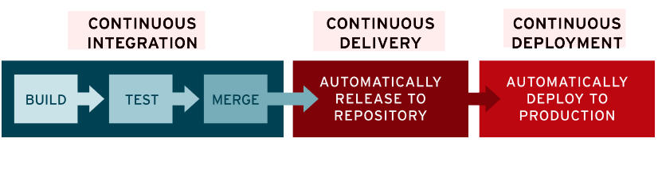
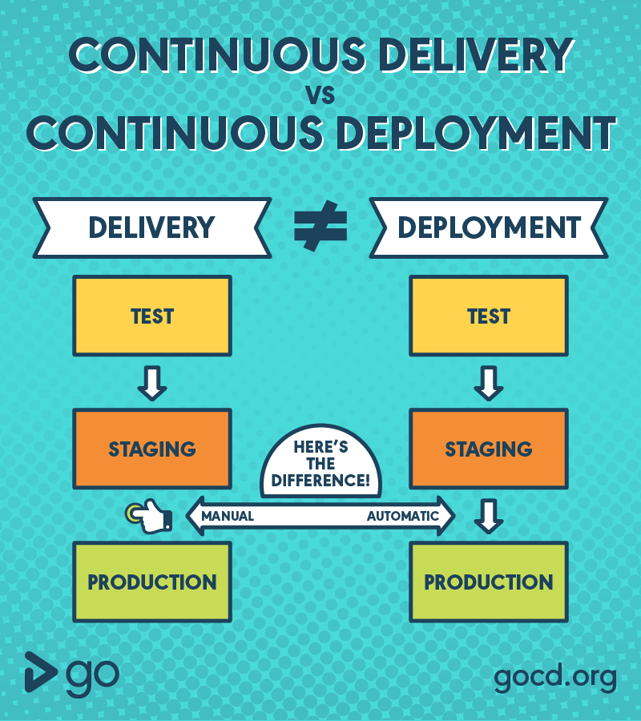

# CI/CD

- [CI/CD](#cicd)
  - [참고 자료](#참고-자료)
  - [지속적 통합(CI, Continuous Integration)](#지속적-통합ci-continuous-integration)
  - [지속적 제공(CD, Continuous Delivery)](#지속적-제공cd-continuous-delivery)
  - [지속적 배포(CD, Continuous deployment)](#지속적-배포cd-continuous-deployment)

## 참고 자료

- [지속적인 통합](continuous-integration.md) - 폴 M. 듀발, 스티븐 M. 마티야스, 앤드류 글로버
- [하루에 1000번 배포하는 조직 되기](https://blog.banksalad.com/tech/become-an-organization-that-deploys-1000-times-a-day/) - 뱅크샐러드
- [CI/CD 5분 개념 정리 (현업에서 쓰는 개발 프로세스)](https://www.youtube.com/watch?v=0Emq5FypiMM) - 드림코딩
- [Continuous integration](https://en.wikipedia.org/wiki/Continuous_integration) - Wikipedia
- [Continuous Integration](https://martinfowler.com/articles/continuousIntegration.html) - Martin Fowler
- [Continuous Integration](https://continuousdelivery.com/foundations/continuous-integration/) - Jez Humble
- [What is CI/CD?](https://www.redhat.com/en/topics/devops/what-is-ci-cd) - Red Hat
- [It’s not CI, it’s just CI theatre](https://www.gocd.org/2017/05/16/its-not-CI-its-CI-theatre/) - gocd (안티 패턴: CI 극장)
- [CI/CD Best Practices](https://www.jetbrains.com/teamcity/ci-cd-guide/ci-cd-best-practices/) - JetBrains
- [How to get started with Continuous Integration](https://www.atlassian.com/continuous-delivery/continuous-integration/how-to-get-to-continuous-integration) - Atlassian
- [Daily Build and Smoke Test](https://stevemcconnell.com/articles/daily-build-and-smoke-test/) - IEEE Software, Vol. 13, No. 4, July 1996, Steve McConnell
- [CI Team responsibilities](https://www.thoughtworks.com/continuous-integration) - Thoughtworks
- [CI (Continuous Integration)이란?](https://www.nextree.co.kr/p10799/) - 넥스트리소프트

*[What is CI/CD?](https://www.redhat.com/en/topics/devops/what-is-ci-cd), Red Hat*

*[What is Continuous Integration?](https://aws.amazon.com/devops/continuous-integration/), AWS*

## 지속적 통합(CI, Continuous Integration)

> 이규원님 [피드 1](https://www.facebook.com/gyuwon.yi/posts/4292538720789318)
>
> 최근 며칠 다음의 것들에 대한 의문을 접했다.
>
> - 200줄 이하의 운영 코드가 추가되는 PR
> - 3개 이하의, 되도록 1개의, 커밋을 담는 PR
> - 숨쉬듯한 Git 리베이스
>
> 이것들이 현실성 없게 느껴지는 이유는 CI 극장(CI theatre)이다.
>
> CI 극장이 아니라 CI를 하고 있다면 어색하지 않고 어쩌면 당연하게 느껴질 것들이다.
>
> CI를 하려면 팀의 모든 코더가 최소 매일 메인 브랜치에 커밋 해야 한다.
> 그리그 그 커밋들은 빌드와 모든 테스트를 통과해야 한다.
> 이것이 실현되려면 PR은 리뷰 하기 쉽게 작아야 하며 완료된 로컬 히스토리는 푸시되기 전에 원자적이고 무결한 형태로 가공되어야 한다.
>
> Git 공식 문서에 다음 내용이 있다.
>
> Don’t push your work until you’re happy with it.
>
> One of the cardinal rules of Git is that, since so much work is local within your clone, you have a great deal of freedom to rewrite your history locally.
> However, once you push your work, it is a different story entirely, and you should consider pushed work as final unless > you have good reason to change it.
> In short, you should avoid pushing your work until you’re happy with it and ready to share it with the rest of the world.
>
> CI가 운영되는 팀의 안정감과 쾌적함은 경험자만이 알 수 있다.

> 이규원님 [피드 2](https://www.facebook.com/photo?fbid=4294786600564530)
>
> ### 공통 정책
>
> - Pull request 완료는 리베이스 병합만 허용한다.
> - 자동 완료를 허용한다. 자동 완료가 활성화된 pull request는 완료에 필요한 모든 조건이 충족되면 자동으로 완료된다.
> - Pull request가 완료되면 브랜치를 자동으로 삭제한다.
> - Pull request 대화는 대화를 시작한 사람이 완료 책임을 갖는다.
> 예를 들어 코드 수정 요청 댓글을 달았다면 댓글 작성자가 코드가 잘 수정되었는지 확인한 후 대화를 완료시켜야 한다.
> 코드를 수정한 사람이 대화를 완료시키면 안된다.
> - 하나의 pull request는 200줄 이하의 운영 코드 추가가 권장된다.
> 운영 코드 추가가 200줄을 초과할 때는 분명한 이유가 있어야 한다.
>   - 추가된 운영 코드가 100줄이 넘어가면 코드를 리뷰하기 어려워지기 시작한다.
>     코드 리뷰가 어려우면 리뷰 품질이 낮아진다.
>     이 수치에 100줄의 여유를 반영해 200줄 이하의 기준을 정한다.
> - 하나의 pull request는 하나의 커밋을 포함하는 것이 가장 권장되며 3개 이하의 커밋이 권장된다.
> 커밋이 3개를 초과할 때는 분명한 이유가 있어야 한다.
> Pull request의 커밋 관리는 `commit --amend`와 `rebase`를 적극 활용하자.
>   - Pull request에 복수의 커밋이 포함된다는 것은 커밋이 무결하지 않거나 또는 하나의 pull request가 둘 이상의 주제를 다룬다는 신호다.
>     두 경우 모두 코드 리뷰를 어렵게 만든다.
>
> ### `main` 브랜치 정책
>
> - 그 누구도 커밋 권한을 갖지 않는 것이 원칙이다.
> - Pull request를 통해서만 커밋을 추가할 수 있다.
> - 심각한 장애 등 긴급한 상황에서만 일시적으로 커밋 권한을 관련된 인원에게 부여한다.
> - 1명 이상의 승인을 받아야 pull request를 완료할 수 있다.
>   - ⚠ Pull request 승인자는 코드 작성자 만큼의 책임을 가진다.
>     편의를 위해 동료의 pull request를 승인하지 말자.
> - Pull request에 새 커밋이 추가되면 기존 승인은 취소된다.
> - 모든 대화가 해결되어야 pull request를 완료할 수 있다.
>
> ### [`rebase`는 Git의 꽃이다](https://www.facebook.com/photo?fbid=4291246567585200)
>
> 우선 모든 팀원의 main 브랜치 커밋 권한을 제거하고 PR을 통해서만 커밋할 수 있게 합니다.
> PR 병합은 리베이스만 가능하게 합니다.
> 그럼 작업 브랜치는 `force push`를 하던 말던 개인의 자유입니다.

> [It’s not CI, it’s just CI theatre](https://www.gocd.org/2017/05/16/its-not-CI-its-CI-theatre/), gocd (안티 패턴: CI 극장)
>
> - "[CI 극장](https://www.thoughtworks.com/radar/techniques/ci-theatre)"은 실제로 지속적 통합(CI)을 실천하지 않으면서 실천하고 있다는 환상을 말합니다. CI 극장의 모습은 다음과 같습니다.
>   - CI를 실천하고 있냐는 질문에 "우리는 CI 서버가 있습니다", "x 도구를 사용합니다"라고 대답합니다.
>   - 하나의 브랜치를 오래 사용하고, 트렁크 브랜치(main, master)를 정기적으로 체크인하지 않습니다.
>   - 브랜치를 병합할 때 불안과 피로를 느낍니다.
>   - 테스트 커버리지가 낮은 빌드를 실행하고, 오랫동안 빌드 상태가 빨간색이도록 방치합니다.
> - CI 극장이 되지 않으려면
>   - 더 자주 커밋 (최소한 매일)
>   - 트렁크 기반 개발
>   - 자동화

> [Continuous Integration](https://martinfowler.com/articles/continuousIntegration.html), Martin Fowler
>
> 일반적으로 모든 개발자가 **적어도 매일** 통합하여 **하루에 여러 번 통합합니다**.
> 각 통합은 가능한 한 빨리 통합 오류를 감지하기 위해 **자동화된 빌드(테스트 포함)에 의해 검증**됩니다.
> 많은 팀은 이 접근 방식이 통합 문제를 크게 줄이고 팀이 응집력 있는 소프트웨어를 보다 신속하게 개발할 수 있게 해준다는 것을 알게 되었습니다.

> [Continuous Integration](https://continuousdelivery.com/foundations/continuous-integration/), Jez Humble
>
> CI 개발자는 정기적으로(**최소한 매일**) **모든 작업을 트렁크(메인라인 또는 마스터라고도 함)에 통합**합니다.

> [What is CI/CD?](https://www.redhat.com/en/topics/devops/what-is-ci-cd), Red Hat
>
> CI를 성공적으로 구현할 경우 새로운 코드 변경 사항이
> 정기적으로 빌드 및 테스트되어 공유 리포지토리에 통합되므로
> 여러 명의 개발자가 동시에 코드 작업을 할 경우
> 서로 충돌할 수 있는 문제를 해결할 수 있습니다.
>
> 그러나 조직에서 특정한 날([merge day](https://thedailywtf.com/articles/Happy_Merge_Day!))을 정해 모든 분기 소스 코드를 병합하는 경우,
> 결과적으로 반복적인 수작업(resolve conflicts 등)에 많은 시간을 소모하게 됩니다.

> [CI Team responsibilities](https://www.thoughtworks.com/continuous-integration), Thoughtworks
>
> - Check in frequently (자주 기록하세요)
> - Don’t check in broken code (망가진 코드를 기록하지 마세요)
> - Don’t check in untested code (테스트되지 않은 코드를 기록하지 마세요)
> - Don’t check in when the build is broken (실패한 빌드를 기록하지 마세요)
> - Don’t go home after checking in until the system builds (기록한 후 빌드가 완료될 때까지 집에 가지 마세요)

> [CI (Continuous Integration)이란?](https://www.nextree.co.kr/p10799/), 넥스트리소프트
>
> 코드 컴플리트(Code Complete)라는 책을 쓴 Steve McConnell은
> 1996년 'Daily Build and Smoke Test'라는 글에서 Microsoft사에서 일일 빌드 체계를 통해서 통합에 대한 위험을 격감시키고,
> Smoke Testing을 통해서 품질을 확보하고 있다는 내용을 언급하고 있습니다.
> 특히, 일일 빌드는 프로젝트에서 심장 박동(heartbeat)에 비유한 Jim MacCarthy의 말을 인용하여 일일 빌드(daily build)를 하지 않는다면,
> 그 프로젝트는 죽은 것과 같다고 표현하고 있습니다. 1990년대 후반부터는 XP(Extreme Programming)에서 CI를 기법으로
> [채용](http://www.extremeprogramming.org/rules/integrateoften.html)했으며), Martin Fowler의
> [Continuous Integration](https://www.martinfowler.com/articles/originalContinuousIntegration.html)이라는 글에서 본격적인 CI 기법에 대한 기본 원칙이 만들어지기 시작헀습니다.
>
> 이 글에서 Fowler는 자동화된 일일 빌드에 대한 기본 원칙을 다음과 같이 4가지로 설명합니다.
>
> - 모든 소스 코드가 살아있고(현재 실행되고) 어느 누구든 현재의 소스를 접근할 수 있는 단일 지점을 유지할 것
> - 빌드 프로세스를 자동화시켜서 어느 누구든 소스로부터 시스템을 빌드하는 단일 명령어를 사용할 수 있게 할 것
> - 테스팅을 자동화시켜서 단일 명령어를 통해서 언제든지 시스템에 대한 건전한 테스트 수트를 실핼할 수 있게 할 것
> - 누구나 현재 실행 파일을 얻으면 지금까지 최고의 실행파일을 얻었다는 확신을 하게 만들 것

## 지속적 제공(CD, Continuous Delivery)

*[What's the difference between Continuous Delivery and Continuous Deployment?](https://www.gocd.org/2017/10/17/difference-between-continuous-delivery-continuous-deployment-infographic.html), gocd*

> [What is CI/CD?](https://www.redhat.com/en/topics/devops/what-is-ci-cd), Red Hat
>
> 운영 서버 배포 전 개발팀이나 QA팀에서 한번 더 확인한 후 수동으로 배포하는 방식입니다.
>
> 변경 사항이 버그 테스트를 거쳐 리포지토리(예: GitHub 또는 컨테이너 레지스트리)에 자동으로 업로드되는 것을 뜻하며, 운영팀은 이 리포지토리에서 애플리케이션을 실시간 프로덕션 환경으로 배포할 수 있습니다.

> [What is Continuous Delivery?](https://continuousdelivery.com/)
>
> - 저위험 릴리스
> - 시장 출시 시간 단축
> - 더 높은 품질
> - 비용 절감
> - 더 나은 제품
> - 더 행복한 팀

## 지속적 배포(CD, Continuous deployment)

> [What is CI/CD?](https://www.redhat.com/en/topics/devops/what-is-ci-cd), Red Hat
>
> 변경 사항을 리포지토리에서 고객이 사용 가능한 프로덕션 환경까지 자동으로 릴리스하는 것을 의미합니다.
> 이는 애플리케이션 제공 속도를 저해하는 수동 프로세스로 인한 운영팀의 프로세스 과부하 문제를 해결합니다.
